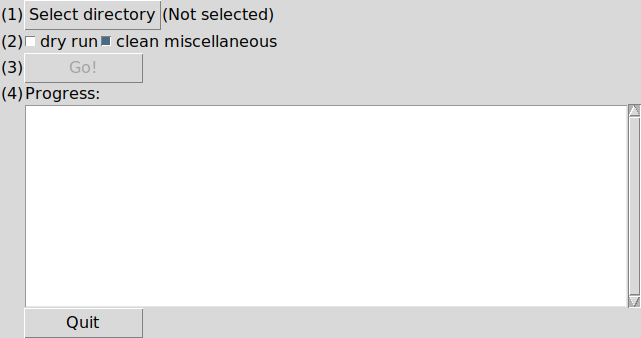

Cleaning up Creo Parametric versioned files
###########################################

:date: 2022-02-12
:author: Roland Smith

.. Last modified: 2022-02-12T00:13:56+0100

Introduction
============

The `Creo Parametric`_ software (f.k.a. Pro/Engineer) saves its files as numbered
versions. While this is in itself commendable (it's nice to be able to
roll-back to a previously known good version of a file) it is an old-fashioned
approach in the age of modern revision control software such as e.g. git_.
If you save often when working in Creo (which is generally a good idea) you
end up with lots of versions of the same file.

.. _Creo Parametric: http://www.ptc.com/cad/3d-cad/creo-parametric
.. _git: http://git-scm.com/

So I wrote a script to help clean up this mess. For obvious reasons it is
called ``creoclean``. As of version 2022.02.11, it is a GUI program.

.. NOTE::

    On ``posix`` platforms like Linux, BSD and OSX, the script is installed
    without an extension. On MS windows platforms, the scripts needs to be
    installed as ``creoclean.pyw`` so that it is linked to the Python program
    that has to run it. So of you are on the windows platform, please read
    ``creoclean.pyw`` whereever you see ``creoclean``.

License
-------

This program is licensed under the `MIT`_ license.

.. _MIT: http://opensource.org/licenses/MIT

Usage
=====

.. NOTE::

    You should probably *close all open files* in the directory *and* purge
    them from the Creo session *before* running this script on a directory!

Start ``creoclean``, e.g. from a link on your desktop. It will like like as
shown below.

* Select a directory to clean.
* Select the required options.
  - ``dry run`` does everything except the actual removal/renaming.
  - ``clean miscellaneous`` also cleans log and information files.
* Press ``Go!`` to start the cleaning process.
* The text window shows the progress of the cleanup operation.

Installation
============

Requirements
------------

This script requires Python 3. It has been developed and tested on Python 3.4.
It has no further dependencies outside of the Python standard library.

General
-------

To install it for the local user, run::

    python setup.py install

This will install it in the user path for Python scripts.
For POSIX operating systems this is ususally ``~/.local/bin``.
For ms-windows this is the ``Scripts`` directory of your Python installation
or another local directory.
Make sure that this directory is in your ``$PATH`` environment variable.

Windows
-------

After installation, you can then call it from a ``cmd.exe`` window, if the ``.py``
extension is associated with a filetype, and the filetype has an appropriate
action defined.  If trying to run ``creoclean.py`` gives an error, try
executing the following commands in a ``cmd.exe`` window::

    assoc .py=Python.File
    ftype Python.File="C:\Anaconda3\python.exe" "%1" %*

Note that ``C:\Anaconda3`` is just an example! You should of course substitute
the real path to your ``python.exe``.

Linux, the BSD variants and OS-X
--------------------------------

The installation program copies ``creoclean`` to ``~/.local/bin``.
Make sure that directory is in your ``$PATH``.
